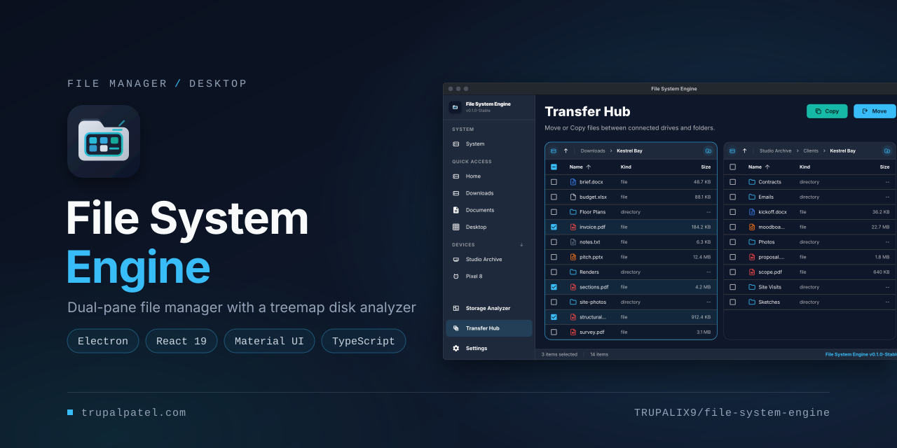
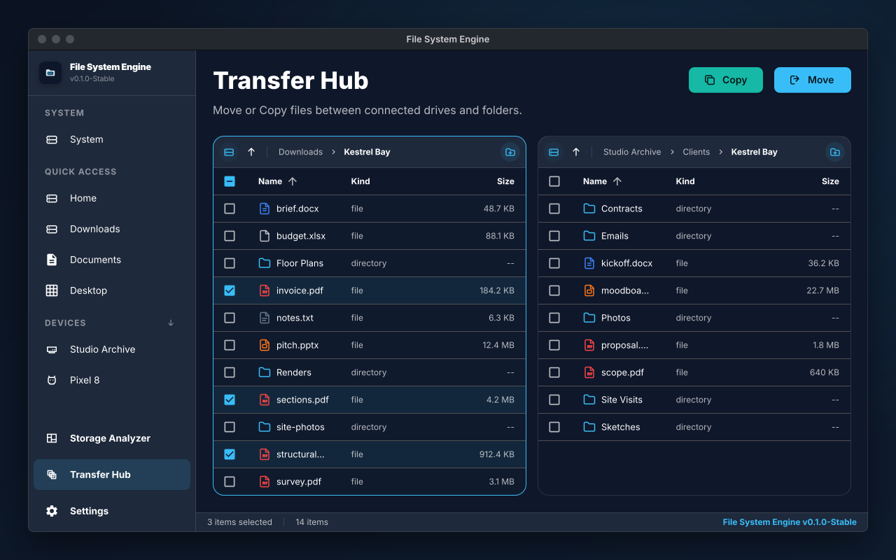
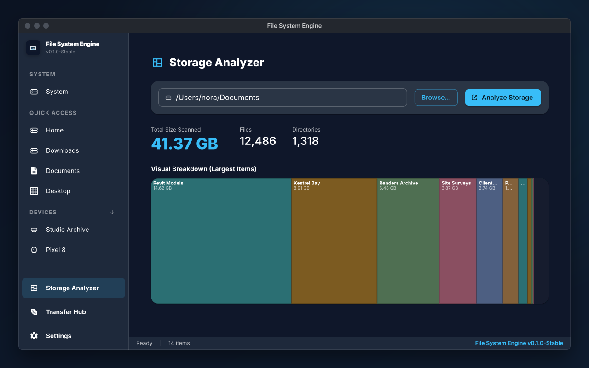
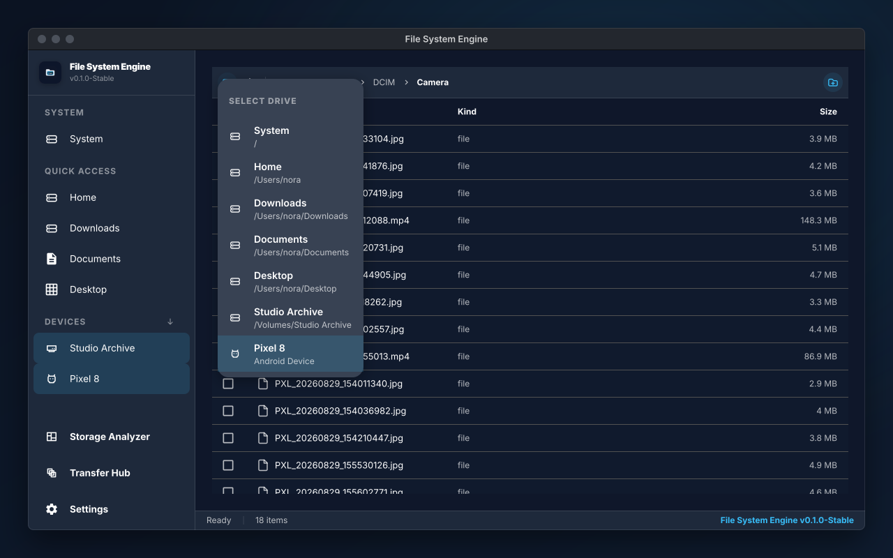
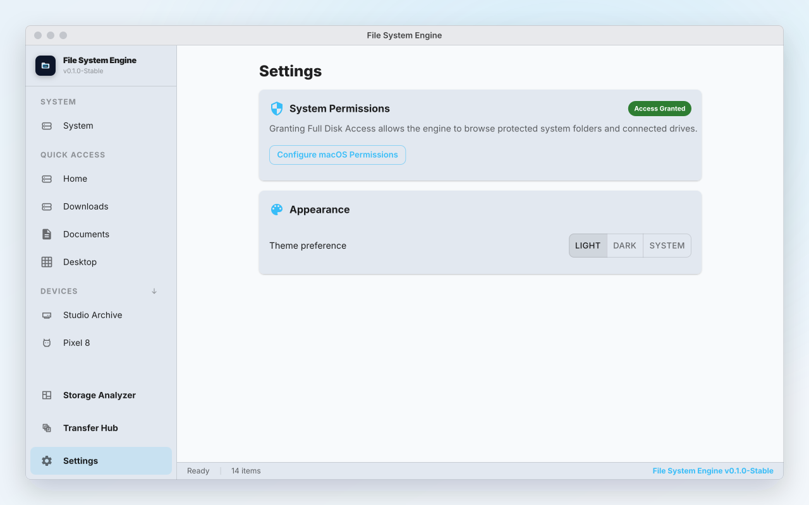
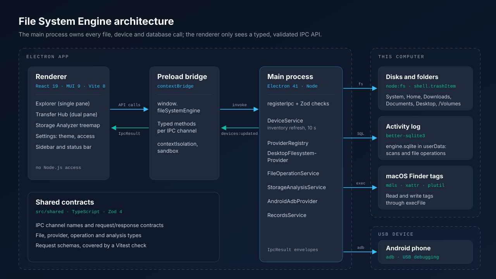
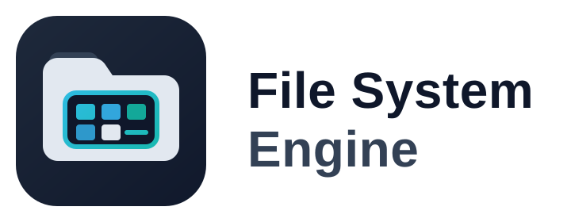

<p align="center">
  
</p>

<p align="center"><strong>A desktop file manager that moves files between drives, folders and Android phones in two panes, and shows where your disk space goes with a treemap analyzer.</strong></p>

<p align="center">
  <a href="https://trupalpatel.com/projects/file-system-engine"></a>
  <a href="https://github.com/TRUPALIX9/file-system-engine/actions/workflows/ci.yml"></a>
  
  
  
  
</p>

<p align="center">
  <a href="https://trupalpatel.com/projects/file-system-engine"><strong>Case study</strong></a> ·
  <a href="https://trupalpatel.com"><strong>Portfolio</strong></a>
</p>

---

## Overview

File System Engine is an Electron desktop app for macOS and Windows (with a Linux AppImage build target) for everyday file housekeeping: moving work between folders, external drives and an Android phone, and finding out which folders are taking up space. It pairs a dual-pane file manager with a Storage Analyzer that scans a folder and draws a treemap of its largest subfolders. Every file, device and database call runs in the Electron main process behind a typed, validated IPC API. It is a personal project at version 0.1.0; duplicate detection and the AI features are planned, not built (see [Roadmap](#roadmap)).

## Features

- **Dual-pane Transfer Hub**: two file panes side by side; Copy or Move the focused pane's selection into the other pane's folder. Moves are confirmed first and never overwrite an item that already exists.
- **Treemap disk analyzer**: the Storage Analyzer scans any folder (up to 50,000 entries), reports total size, file and directory counts, and draws a treemap strip of the top-level folders sized by their share of the total. Partial scans are flagged.
- **Drives, folders and Android phones in one sidebar**: System, Home, Downloads, Documents and Desktop, mounted volumes (`/Volumes` on macOS, drive letters on Windows, `/media` and `/mnt` on Linux), and Android devices over adb. The device list refreshes every 10 seconds.
- **Everyday file actions**: new folder, rename and delete (desktop items go to the Trash), pin folders to Quick Access, multi-select with Cmd/Ctrl and Shift, sort by name, kind or size, and navigate with breadcrumbs and Up.
- **Platform awareness**: a macOS Full Disk Access check with a shortcut to System Settings, and a read-only warning with driver guidance for NTFS drives on macOS.
- **Locked-down Electron shell**: context isolation, a sandboxed renderer, a typed preload API, Zod validation of every IPC request, path checks that keep requests inside the chosen drive, a production CSP, and adb commands run through `execFile` with single-quoted device arguments.
- **Light, dark or system theme**, plus a local SQLite activity log of scans and file operations.

## Screenshots

<table>
  <tr>
    <td align="center" width="50%">
      
      <br /><sub><b>Transfer Hub</b>: two panes, Copy and Move between them</sub>
    </td>
    <td align="center" width="50%">
      
      <br /><sub><b>Storage Analyzer</b>: totals and a treemap of the largest folders</sub>
    </td>
  </tr>
  <tr>
    <td align="center" width="50%">
      
      <br /><sub><b>Explorer</b>: an Android phone over adb, with the drive menu open</sub>
    </td>
    <td align="center" width="50%">
      
      <br /><sub><b>Settings</b>: macOS permissions and theme, in the light theme</sub>
    </td>
  </tr>
</table>

<sub>Screens are recreated from the app's real UI in SVG, filled with fictional demo data.</sub>

## Architecture

<p align="center">
  
</p>

The React renderer never touches Node.js. It calls `window.fileSystemEngine`, which the preload bridge maps to `ipcRenderer.invoke` on typed channels. The main process validates each request with Zod, routes it through the provider registry to the desktop filesystem or the Android adb provider, and returns an `IpcResult` envelope (`{ ok, data }` or `{ ok: false, error }`). Device changes are pushed back on `devices:updated`, and scans and file operations are logged to SQLite.

## Tech stack

| Layer | Technology |
|---|---|
| Desktop shell | Electron 41 (context isolation, sandbox, typed preload bridge) |
| UI | React 19, MUI 9 with Emotion, Inter |
| Main process | Node.js, `node:fs`, Zod 4 request validation, better-sqlite3 activity log |
| Devices | adb CLI for Android, macOS `mdls`/`xattr`/`plutil` for Finder tags |
| Build and packaging | TypeScript 6, Vite 8 (separate main, preload and renderer builds), electron-builder 26, sharp for the app icon |
| Quality | Vitest 4, GitHub Actions (build, test, `npm audit`) |

## Getting started

### Prerequisites

- Node.js 20.19 or newer (CI uses Node 24)
- npm
- Optional, for Android devices: Android platform-tools (`adb`) and a phone with USB debugging allowed. The app looks for adb in `~/Library/Android/sdk/platform-tools`, `/usr/local/bin`, `/opt/homebrew/bin` and `%LOCALAPPDATA%\Android\Sdk\platform-tools`, then on your `PATH`.
- Optional, on macOS: grant the app (or your terminal, in development) Full Disk Access to browse protected folders.

### Install

```bash
git clone https://github.com/TRUPALIX9/file-system-engine.git
cd file-system-engine
npm install
```

`better-sqlite3` is a native module. If the activity log reports a `NODE_MODULE_VERSION` mismatch when running under Electron in development, rebuild it for Electron:

```bash
npx electron-builder install-app-deps
```

No environment variables are required. `npm run dev` sets `VITE_DEV_SERVER_URL` itself.

### Run

```bash
npm run dev      # Vite dev server on http://127.0.0.1:5173 plus Electron, with DevTools
```

Other scripts:

```bash
npm test         # Vitest
npm run build    # generate build/icon.png, type-check, build main, preload and renderer into dist/
npm start        # run the built app with Electron
npm run pack     # build and package an unpacked app with electron-builder
npm run dist     # build installers for the current OS (macOS default target, Windows NSIS, Linux AppImage)
```

`scripts/check-android.mjs` is a standalone adb diagnostic: `node scripts/check-android.mjs`.

## Project structure

```text
file-system-engine/
├── src/
│   ├── main/            # Electron main process: IPC handlers, providers, file operations, storage analysis, SQLite
│   ├── preload/         # contextBridge API exposed to the renderer as window.fileSystemEngine
│   ├── renderer/        # React UI: Explorer, Transfer Hub, Storage Analyzer, Settings
│   └── shared/          # IPC channels and contracts, shared types, Zod request schemas
├── public/              # app icon, logo lockups and the UI icon set
├── scripts/             # dev launcher, icon generator, adb diagnostic
├── build/icon.png       # packaging icon generated from the master SVG
├── docs/                # phase notes, brand pack, README assets
├── agents/ · skills/    # role briefs and engineering guardrails used while building the app
├── vite*.config.ts      # separate builds: main (ESM), preload (CJS), renderer
└── .github/workflows/   # CI: install, build, test, audit
```

## Roadmap

Phases 1 to 8 (app shell, IPC contracts, desktop and Android providers, file operations and the Storage Analyzer) are in place. Still to come:

- [ ] Scan jobs with persistence <sub>(`scan:start` / `scan:get` are placeholders in `src/main/app/registerIpc.ts`)</sub>
- [ ] Duplicate file detection <sub>(Phase 9; `duplicates:find` returns no groups yet)</sub>
- [ ] Local AI engine via Ollama <sub>(Phase 10; `ai:status` reports it as missing)</sub>
- [ ] Document text extraction <sub>(`mammoth`, `pdf-parse` and `csv-parse` are declared but not wired in yet)</sub>

## Author

**Trupal Patel**

<p>
  <a href="https://trupalpatel.com">Portfolio</a> ·
  <a href="mailto:trupal.work@gmail.com">trupal.work@gmail.com</a> ·
  <a href="https://www.linkedin.com/in/trupalix">LinkedIn</a> ·
  <a href="https://github.com/TRUPALIX9">GitHub</a>
</p>

<p align="center">
  <picture>
    <source media="(prefers-color-scheme: dark)" srcset="docs/assets/logo-light.svg" />
    
  </picture>
</p>
